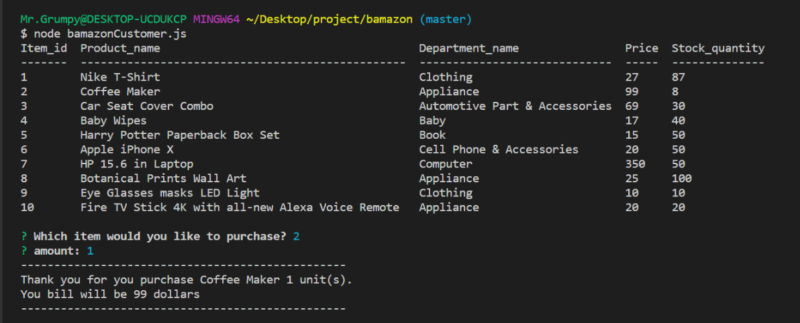

# Bamazon Store Project Application

This app will display all item names, amount of units, department, and price. After that, it will ask a customer to choose which item they are interested in. Also, it will ask how many items that they need.

- If the store have enough amount of items the stock will subtract and update a new unit item. 
- If the store do not have enough item, it will show that how many item the store have and ask buyer again.

# Screenshot

# Video

